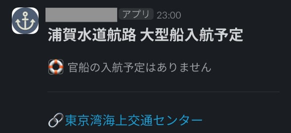
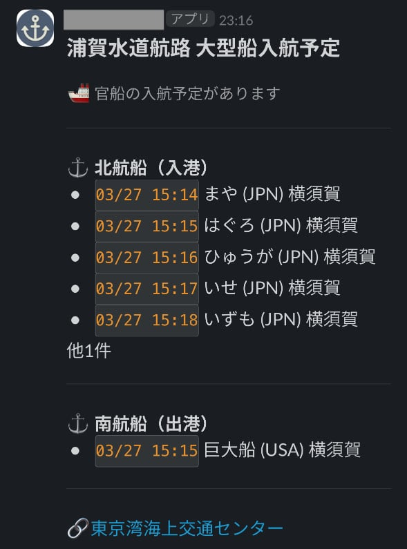

# 浦賀水道航路ウォッチャー

## 概要

東京湾海上交通センターが公開されている[浦賀水道航路の大型船入航予定情報](https://www6.kaiho.mlit.go.jp/tokyowan/schedule/URAGA/schedule_2.html)をスクレイピングして、「官船」の入航予定を取得し、Slackに通知します。

Cloudflare WorkersのCron Triggersを使って毎日6,12,18時に実行します。

## 通知の例

### 入航予定がないとき



### 入航予定があるとき



## Getting Started

### 1. Installation

```
npm install
```

### 2. Setup

SlackのIncoming Webhook URLを取得し、以下のコマンドに続けて出てくるプロンプトに入力してCloudflare WorkersのSecretsに登録します。

```
npx wrangler secret put SLACK_WEBHOOK_URL
```

### 3. Deployment

```
npm run deploy
```


## License

[MIT](./LICENSE.txt)


## Author

[@rsky](https://github.com/rsky)
